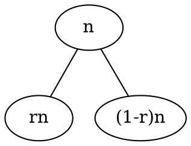

# Quick Sort

## Intro

Quick Sort is a advanced sorting method, which uses the "divide and conquer" strategy. 
One of the features is that, it does not need to ask much memory from system, instead, it consume some Stack space, due to it's recursive property.

## Implement

Since left bound and left bound does not collide(conquer):

1. Choose a pivot, I choose leftest element in this implementation.
2. Scan the subarray, from left to right, to find element that is bigger than pivot.
3. Scan the subarray, from right to left, to find element that is smaller than pivot.
4. swap them.

When two pointers meet, swap pivot and the pointer that points to left bound.

At this moment, pivot will at the absolutely right place, it will be there 'till the end. And the elements at left side are not larger than pivot, the elements at right side are not smaller than pivot.

Then tackle on both sides(division).

## Analysis

### Time(Under this partition implementation)

#### Best Case: $O(nlgn)$

The condition is that, the subarray can be perfectly divided into half.

You may want to write down a recursive function:

$$T(n) = 2 \times T(\frac{n}{2}) + cn$$

with $c$ is a constant.

You can use master theorem to get a $\theta(nlgn)$.

#### Avg. Case: $O(nlgn)$

If you don't bumped into a `0 | n` partition when partitioning.

Let's draw a recursive tree:

Noted that 0 < r < 1.



From this graph with some simple analysis that you can refer to some reference about what a recursive tree like this indicates, we can tell that this recursion's time complexity is about $O(nlgn)$.

#### Worst Case: $O(n^2)$

If you unfortunately, divids the subarray in `0 | n`:

The recusive functions become:

$$T(n) = T(n-1) + n$$

Which answer is $O(n^2)$.

Mainly, this occurs if you choose the minimum or maximum element in subarray.

So, how to avoid?

1. Choose middle of the three:
   Choose the median of the first, middle and last element in current subarray.

2. Choose the [Median of medians](https://en.wikipedia.org/wiki/Median_of_medians)
   1. Divides the numbers into groups, e.g., each five elements form a group.
   2. Choose the third element, which is the median in the subsubarray.
   3. Choose the median in these medians.

   Therefore, the number you get is very likely to be in the middle of the array.

### Space

O(lgn)~O(n).

It depends on how many times that you call quicksort.

If you encounter the best case(divide into half), the time can regard as the height of a binary tree with n nodes.

### Stable

Think of the condition of:

```
| 5* | 5 | 5 | 5 | 5 | -> | 5 | 5 | 5 | 5 | 5* | (in my implementation)

or 

| 5* | 5 | 5 | 5 | 5 | -> | 5 | 5 | 5* | 5 | 5 | (in another person's implementation)
```
